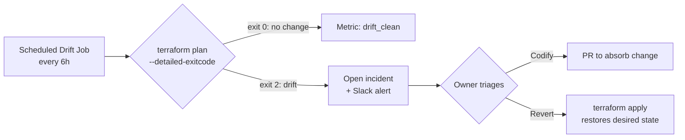
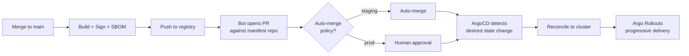

# The Zero-Trust Delivery Platform: Engineering CI/CD as a Security, FinOps and Velocity Substrate

> A field manual for Staff and Principal engineers building delivery platforms that are simultaneously hostile to attackers, unforgiving to budget overruns, and invisible to the developers consuming them.

---

## 1. Introduction - CI/CD is Not Automation. It is the Company's Spine.

There is a persistent organizational fiction that CI/CD is "the script that pushes code to production." That framing is how you end up with a $40k/month build farm, a Software Bill of Materials nobody can produce on demand during an audit, a 47-minute mobile pipeline that engineers route around with manual TestFlight uploads, and a Kubernetes cluster where 30% of nodes are running pods nobody can attribute to a service owner.

CI/CD, properly understood, is the **substrate on which four orthogonal concerns are continuously enforced**:

1. **Security posture** - every artifact, from a Terraform plan to a signed container image, is provably traceable to a commit, an author, a reviewer, and a policy decision.
2. **FinOps discipline** - cost is a build-time concern, not a month-end surprise. Budget violations fail the pull request, not the quarterly review.
3. **Engineering velocity** - measured in DORA terms (lead time, deployment frequency, change failure rate, MTTR), not in vanity metrics like "builds per day."
4. **Developer experience (DevEx)** - the cognitive load required to ship safely is bounded and constant, regardless of the underlying architectural complexity.

When any one of these collapses, the others degrade in cascade. A pipeline that is fast but unsigned is a supply chain breach waiting for a CVE. A pipeline that is secure but takes 22 minutes to give feedback on a typo will be circumvented within two sprints. A pipeline that is fast and secure but provisions a $1,200/month preview environment per pull request will be killed by the CFO before it proves its value.

This article is a synthesis of an opinionated reference architecture - the one I deploy when given a green field, and the one I refactor toward when inheriting the brown ones. It is grounded in two recent production systems used here as implicit references: **TAOGuardian**, a Go-based distributed backend running on Kubernetes with Web3/Bittensor workloads where supply-chain integrity and OOMKilled auto-remediation are first-class concerns, and **Azimuth**, a Flutter mobile application where the entire commit-to-store-submission lead time is held to **1 minute 17 seconds** as a non-negotiable platform SLO.

The architecture below is the bridge between those two extremes - long-running stateful backend services and ephemeral mobile release trains - under a single Zero-Trust delivery contract.

---

## 2. Stage 0 - Infrastructure Provisioning and the FinOps Shift-Left

Before the first line of application code is built, the infrastructure pipeline has already executed. Treating IaC as a peer of application code - same review gates, same signing, same policy enforcement - is the single highest-leverage architectural decision in this entire document.

### 2.1 The Provisioning Substrate

**Terraform / OpenTofu** is the lingua franca, but the pipeline matters more than the tool. The non-negotiable properties:

- **Remote state with locking** (S3 + DynamoDB, or GCS + native locking, or Terraform Cloud / Spacelift / env0 for managed). State files are encrypted at rest with a customer-managed key.
- **Workspace-per-environment** with strict naming (`prod-eu-west-1`, `staging-us-east-1`). No `default` workspace ever reaches production.
- **Module registry** - internal modules are versioned, semver-tagged, and consumed via pinned references. No `ref=main` in any production stack.
- **Plan as a first-class artifact** - `terraform plan -out=tfplan` is uploaded, signed, and the apply stage consumes the exact binary plan. This eliminates the TOCTOU window where a plan and an apply could diverge.

```hcl
# Example: pinned module consumption - never `ref=main`
module "k8s_node_pool" {
  source = "git::ssh://git@internal.git/platform/tf-modules.git//eks/node-pool?ref=v3.4.1"

  cluster_name      = local.cluster_name
  instance_types    = ["m6i.large", "m6i.xlarge"]
  capacity_type     = "SPOT"
  max_unavailable   = 1
  taints            = local.workload_taints

  # FinOps tags are mandatory and validated at policy gate
  tags = merge(local.mandatory_tags, {
    cost_center = var.cost_center
    owner_email = var.owner_email
    ttl         = var.ttl  # null for prod, RFC3339 timestamp for ephemeral
  })
}
```

### 2.2 Shift-Left FinOps - Failing the PR Before the Money Burns

The most expensive infrastructure mistake is the one that ships and runs for three weeks before someone notices the bill. **Infracost** is wired into the IaC pipeline as a blocking check on the pull request:

```yaml
# .github/workflows/iac-finops.yml (excerpt)
- name: Generate Infracost diff
  run: |
    infracost breakdown --path=. --format=json --out-file=/tmp/baseline.json \
      --terraform-var-file=environments/${{ inputs.env }}.tfvars

    infracost diff --path=/tmp/baseline.json \
      --compare-to=/tmp/main-baseline.json \
      --format=json --out-file=/tmp/diff.json

- name: Enforce budget policy
  run: |
    DELTA=$(jq -r '.diffTotalMonthlyCost' /tmp/diff.json)
    THRESHOLD=$(yq '.budgets.${{ inputs.env }}.pr_delta_usd' .platform/budgets.yaml)

    if (( $(echo "$DELTA > $THRESHOLD" | bc -l) )); then
      echo "::error::PR introduces +\$${DELTA}/mo, exceeds threshold \$${THRESHOLD}/mo"
      exit 1
    fi

- name: Post breakdown to PR
  run: infracost comment github --path=/tmp/diff.json --behavior=update
```

The mechanic is intentional. A developer adding a `db.r6g.4xlarge` "for testing" sees `+$1,847.20/month` rendered as a comment on their PR within 90 seconds. The change is not blocked by a human; it is blocked by a policy file that the platform team owns. Budgets are codified per environment - preview environments might allow `+$50/mo`, staging `+$300/mo`, production requires explicit FinOps approval over a configured threshold.

### 2.3 Static Analysis and Drift Detection - The Twin Hygienic Imperatives

**`tfsec` and `checkov`** run on every plan. They catch the predictable failure modes - public S3 buckets, security groups open to `0.0.0.0/0` on port 22, RDS instances without encryption at rest, IAM policies with `Action: "*"` paired with `Resource: "*"`. These are not interesting findings; they are baseline hygiene. The interesting work is suppressing the false positives with documented exceptions, codified in policy:

```yaml
# .checkov.yaml
skip-check:
  - CKV_AWS_50  # X-ray tracing not required for batch workloads
soft-fail-on:
  - LOW
hard-fail-on:
  - HIGH
  - CRITICAL
```

**Drift detection** is the part most teams skip and then regret. A scheduled job runs `terraform plan -detailed-exitcode` against every workspace, every six hours. Exit code 2 (changes detected outside the pipeline) opens an incident ticket and posts to the platform Slack channel. This is how you find the engineer who logged into the AWS console at 2am to "just fix one thing" - not to punish them, but to either codify their fix or revert it before it becomes the load-bearing undocumented configuration that kills you nine months later.



This is how you eliminate shadow IT. Not by policy memos. By a job that runs every six hours and refuses to be quiet.

---

## 3. The SDLC Pipeline - Maximum Performance, Minimum Cognitive Load

The application pipeline is decomposed into three phases. Each phase has a tight contract: a maximum latency, a clear set of artifacts produced, and an explicit set of gates. Phases are concurrent where the dependency graph allows.

### Phase A - Local (the Millisecond-Zero Defense)

The cheapest place to catch a defect is on the developer's laptop, before the commit object is even written. The `pre-commit` framework orchestrates this:

```yaml
# .pre-commit-config.yaml
repos:
  - repo: https://github.com/gitleaks/gitleaks
    rev: v8.21.2
    hooks:
      - id: gitleaks
  - repo: https://github.com/pre-commit/pre-commit-hooks
    rev: v5.0.0
    hooks:
      - id: trailing-whitespace
      - id: end-of-file-fixer
      - id: check-merge-conflict
      - id: detect-private-key
  - repo: local
    hooks:
      - id: go-fmt
        name: gofmt
        entry: gofmt -l -w
        language: system
        files: \.go$
      - id: dart-format
        name: dart format
        entry: dart format --set-exit-if-changed
        language: system
        files: \.dart$
```

**Gitleaks** is the load-bearing hook. An AWS access key, a Stripe secret, a JWT signing secret - caught before they ever reach the remote. The same `gitleaks` invocation runs server-side as a CI gate, because pre-commit hooks are advisory; a developer can `--no-verify` past them. The server-side gate is not advisory.

This phase is also where the **`Makefile` or `Taskfile` is the sole entry point**. Developers run `make test`, `make lint`, `make build` - never `go test ./... -race -count=1 -coverprofile=...`. The exact same commands run in CI. Divergence between local and CI behavior is a platform bug, not a developer problem.

### Phase B - Dev / PR (Fast Feedback as a Contract)

The PR pipeline has a single SLO: **p95 feedback time under 4 minutes for backend, under 2 minutes for mobile**. Everything else is in service of that number.

**Aggressive caching** is the first lever. For the Go backend (TAOGuardian-class workloads):

```yaml
# .github/workflows/pr-backend.yml (excerpt)
- uses: actions/cache@v4
  with:
    path: |
      ~/.cache/go-build
      ~/go/pkg/mod
    key: go-${{ runner.os }}-${{ hashFiles('**/go.sum') }}-${{ hashFiles('**/*.go') }}
    restore-keys: |
      go-${{ runner.os }}-${{ hashFiles('**/go.sum') }}-
      go-${{ runner.os }}-

- name: Test (changed packages only)
  run: |
    CHANGED_PKGS=$(git diff --name-only origin/main...HEAD \
      | grep '\.go$' | xargs -r dirname | sort -u \
      | sed 's|^|./|' | tr '\n' ' ')
    if [ -z "$CHANGED_PKGS" ]; then
      echo "No Go changes, skipping test"
      exit 0
    fi
    go test -race -count=1 -timeout 5m $CHANGED_PKGS
```

The `changed packages only` strategy reduces the median PR test runtime by 60–80% on a mature codebase. The full test suite still runs - but on the merge queue, not on every PR push. Developers iterate fast; main branch integrity is preserved by the merge gate.

For the Flutter mobile pipeline (Azimuth-class), the equivalent is **delta compilation** with persistent build daemons and cache hydration from a previous successful main build. The 1m17s end-to-end lead time is achievable because:

- Pub cache is pre-warmed in the container image.
- Gradle daemon survives across builds via a self-hosted runner pool.
- iOS code-signing artifacts (provisioning profiles, certificates) are fetched once and mounted, not re-downloaded per build.
- The `flutter build appbundle --tree-shake-icons --split-debug-info=...` invocation runs concurrently with the iOS `xcodebuild archive`, on separate runners, joined at the publish gate.

**SAST runs in delta mode.** A full SonarQube scan on a 400k LOC codebase takes 8–14 minutes; that latency in a PR is intolerable. The PR scan analyzes only changed files against the baseline:

```bash
sonar-scanner \
  -Dsonar.projectKey=taoguardian \
  -Dsonar.pullrequest.key=${PR_NUMBER} \
  -Dsonar.pullrequest.branch=${HEAD_REF} \
  -Dsonar.pullrequest.base=main \
  -Dsonar.qualitygate.wait=true
```

The quality gate is configured against **new code only** - coverage on changed lines >= 80%, no new critical issues, no new security hotspots. This is the only sustainable model for legacy codebases. A "100% coverage" gate against the entire codebase in a brownfield project is a political statement, not an engineering one.

**AIOps in the PR loop** is the genuinely new capability. Two integrations earn their keep:

1. **PR summarization** - a Claude / GPT / Llama-class model called via the platform's gateway produces a structured summary: *what changed, what risks were introduced, which downstream services consume the modified API surface*. This is not a replacement for human review; it is a reviewer accelerant.
2. **Logical anomaly detection** - diffs are scored against a model trained on historical defect-introducing changes. A change that touches a nil-check in a hot path, removes a `defer rows.Close()`, or modifies a retry budget without updating the corresponding circuit breaker config gets flagged with a high-confidence comment. False positive rates matter; we tune for precision over recall and treat the comments as advisory.

### Phase C - QA / Staging (Preview Environments with Hard TTLs)

Every PR that passes Phase B provisions a **preview environment**: a namespaced deployment in a shared Kubernetes cluster, with its own ingress hostname (`pr-1247.preview.platform.internal`), seeded test data, and stubbed external dependencies.

The preview environment has a **TTL annotation** that the platform's reaper job enforces:

```yaml
metadata:
  annotations:
    platform.io/ttl: "72h"
    platform.io/owner: "claudio@example.com"
    platform.io/pr: "1247"
    platform.io/cost-center: "platform-eng"
```

A controller (a few hundred lines of Go) lists namespaces every 15 minutes, evaluates the TTL against the namespace's `creationTimestamp`, and deletes expired environments. Merged PRs trigger immediate teardown via webhook. This is the FinOps mechanism that makes preview environments financially viable - without it, you accumulate 400 zombie namespaces and a $9k/month cluster bill.

```go
// Reaper controller core loop (simplified)
func (r *Reaper) reconcile(ctx context.Context) error {
    nss, err := r.client.CoreV1().Namespaces().List(ctx, metav1.ListOptions{
        LabelSelector: "platform.io/preview=true",
    })
    if err != nil {
        return fmt.Errorf("list namespaces: %w", err)
    }

    for _, ns := range nss.Items {
        ttl, ok := ns.Annotations["platform.io/ttl"]
        if !ok {
            continue
        }
        d, err := time.ParseDuration(ttl)
        if err != nil {
            r.log.Warn("invalid TTL", "ns", ns.Name, "ttl", ttl)
            continue
        }
        if time.Since(ns.CreationTimestamp.Time) > d {
            r.log.Info("reaping expired preview", "ns", ns.Name)
            if err := r.deleteNamespace(ctx, ns.Name); err != nil {
                r.metrics.ReapErrors.Inc()
                continue
            }
            r.metrics.ReapSuccess.Inc()
        }
    }
    return nil
}
```

**E2E tests** run against the preview environment. Playwright for web, Patrol or integration_test for Flutter, k6 for API contract and load smoke. Tests are sharded across runners; the slowest shard determines wall-clock time. Flaky tests are quarantined automatically - a test that fails twice in seven days on otherwise green runs is moved to a `quarantine` suite that doesn't block the merge but is reported daily. This is the only honest way to deal with flakiness; pretending it doesn't exist breeds learned helplessness.

**SBOM generation and cryptographic signing** happen at the artifact build, not at deploy. This is the SLSA Level 3+ contract:

```bash
# Build the image with reproducible metadata
docker buildx build \
  --provenance=mode=max \
  --sbom=true \
  --tag $REGISTRY/taoguardian:$SHA \
  --push \
  .

# Generate a detailed SBOM (SPDX format)
syft $REGISTRY/taoguardian:$SHA -o spdx-json=sbom.spdx.json

# Sign the image with Cosign (keyless, OIDC-backed)
cosign sign --yes $REGISTRY/taoguardian:$SHA

# Attach the SBOM as a signed attestation
cosign attest --yes \
  --predicate sbom.spdx.json \
  --type spdxjson \
  $REGISTRY/taoguardian:$SHA

# Generate and sign the SLSA provenance attestation
cosign attest --yes \
  --predicate provenance.json \
  --type slsaprovenance \
  $REGISTRY/taoguardian:$SHA
```

The deployment cluster's admission controller (Kyverno or Sigstore Policy Controller) **refuses to admit any pod whose image is not signed by a trusted identity and accompanied by a valid SBOM attestation**. This is the supply chain firewall. A compromised CI runner cannot push an image that production will accept, because the OIDC identity used to sign is bound to the workflow that ran, and the policy enforces the expected workflow path.

```yaml
# Kyverno ClusterPolicy (excerpt)
apiVersion: kyverno.io/v1
kind: ClusterPolicy
metadata:
  name: require-signed-images
spec:
  validationFailureAction: Enforce
  rules:
    - name: verify-signature
      match:
        any:
          - resources:
              kinds: [Pod]
      verifyImages:
        - imageReferences:
            - "registry.internal/*"
          attestors:
            - entries:
                - keyless:
                    subject: "https://github.com/org/*/.github/workflows/release.yml@*"
                    issuer: "https://token.actions.githubusercontent.com"
          attestations:
            - predicateType: https://spdx.dev/Document
            - predicateType: https://slsa.dev/provenance/v1
```

This is what "Zero-Trust Software Supply Chain" actually means in concrete terms. Not a marketing phrase. A `kubectl apply` that fails because a signature is missing.

---

## 4. Production, Progressive Delivery, and the Closed Observability Loop

Production deployment is the easiest part of this architecture, because by the time an artifact reaches it, every interesting decision has already been made and recorded.

### 4.1 GitOps as the Production Contract

**ArgoCD or Flux** owns the cluster. The CI pipeline never runs `kubectl apply` against production. The CI pipeline produces a signed image and updates a manifest in a Git repository; ArgoCD reconciles. This separation is critical:

- The blast radius of a compromised CI runner is bounded - it can propose changes (open a PR against the manifest repo) but cannot apply them.
- Rollback is a `git revert`. Auditable, reviewable, and recoverable from human memory at 3am.
- The cluster's actual state is provably equal to the Git state, or an alert fires.



### 4.2 Argo Rollouts and the AIOps-Driven Auto-Rollback

Production deploys are never "all at once." **Argo Rollouts** orchestrates a canary or blue/green strategy with automated analysis:

```yaml
apiVersion: argoproj.io/v1alpha1
kind: Rollout
metadata:
  name: taoguardian-api
spec:
  strategy:
    canary:
      steps:
        - setWeight: 5
        - pause: { duration: 2m }
        - analysis:
            templates:
              - templateName: success-rate
              - templateName: latency-p99
              - templateName: aiops-anomaly
            args:
              - name: service
                value: taoguardian-api
        - setWeight: 25
        - pause: { duration: 5m }
        - analysis:
            templates: [success-rate, latency-p99, aiops-anomaly]
        - setWeight: 50
        - pause: { duration: 10m }
        - setWeight: 100
```

Each `analysis` step queries Prometheus and the AIOps service. The contract:

- **success-rate**: `sum(rate(http_requests_total{status!~"5..",service="$service"}[2m])) / sum(rate(http_requests_total{service="$service"}[2m])) >= 0.995`
- **latency-p99**: `histogram_quantile(0.99, ...) <= baseline_p99 * 1.20`
- **aiops-anomaly**: a custom analysis provider that calls an internal anomaly detection service. The service ingests logs, traces, and metrics from the canary and compares the multivariate distribution against the stable version. A score above a threshold fails the analysis.

When any analysis step fails, the rollout aborts and reverts the weight to 0. **No human is paged for the rollback itself** - humans are paged for the post-mortem. The MTTR for a defective deploy is bounded by the analysis interval, typically under 10 minutes from merge to full revert.

This is also where the OOMKilled auto-remediation loop closes in TAOGuardian-class workloads. When the canary triggers OOM events above baseline, the AIOps service correlates with recent commits and posts a structured comment to the offending PR - *"deploy `abc123` reverted; OOM rate increased 4.2x in canary; suspected cause: unbounded slice growth in `worker.processBatch` introduced in commit `abc123`, line 142"*. The engineer wakes up to a triaged regression, not an alphabet soup of CloudWatch alarms.

### 4.3 DORA as the Platform's Output Metric

The four DORA metrics are emitted as first-class signals by the platform itself, not gathered by a quarterly survey:

| Metric | Source | Where it lives |
|---|---|---|
| Lead time for changes | `merge_commit_timestamp - first_commit_timestamp` | Pipeline event bus |
| Deployment frequency | Count of successful prod deploys / window | ArgoCD events |
| Change failure rate | Rollbacks + hotfixes / total deploys | Argo Rollouts + incident tracker |
| MTTR | `incident_resolved_at - incident_started_at` | Incident tracker |

These are visible on the Backstage homepage for every service. A service whose change failure rate exceeds 15% over a rolling 30-day window has its production auto-merge privilege revoked until remediation. This sounds harsh; in practice it is the most effective forcing function for test investment I have ever deployed.

---

## 5. Platform Engineering - Wrapping the Complexity in Golden Paths

Everything described above is, from a developer's perspective, a problem. The platform team's job is to make it disappear.

### 5.1 The Backstage Developer Portal

**Backstage** (or any equivalent - Port, Cortex, a homegrown solution) is the front door. A developer joining the team on Monday should be productive on Tuesday. They should not need to know:

- Which Kubernetes cluster their service runs in.
- The Terraform module needed to provision a Postgres database.
- How Cosign signing keys are managed.
- Where to find the runbook for OOMKilled remediation.

They should know one thing: *the catalog*. Every service, every database, every preview environment, every dashboard, every runbook - discoverable from a single search box.

### 5.2 Software Templates as the Golden Path

A new service is created from a template:

```yaml
# Backstage Software Template (excerpt)
apiVersion: scaffolder.backstage.io/v1beta3
kind: Template
metadata:
  name: go-service-grpc
  title: Go gRPC Microservice
  description: Production-grade Go service with gRPC, OTel, and the full delivery pipeline pre-wired
spec:
  parameters:
    - title: Service identity
      properties:
        name: { type: string, pattern: '^[a-z][a-z0-9-]{2,30}$' }
        owner: { type: string, ui:field: OwnerPicker }
        cost_center: { type: string, enum: [platform, product, data, ml] }
        tier: { type: string, enum: [tier-0, tier-1, tier-2, tier-3] }
  steps:
    - id: fetch
      action: fetch:template
      input:
        url: ./skeleton
        values: { name: ${{ parameters.name }}, owner: ${{ parameters.owner }} }
    - id: publish
      action: publish:github
      input:
        repoUrl: github.com?owner=org&repo=${{ parameters.name }}
        defaultBranch: main
        protectDefaultBranch: true
        requiredApprovingReviewCount: 1
        requiredStatusCheckContexts:
          - "ci / lint"
          - "ci / test"
          - "ci / sast"
          - "ci / sbom"
    - id: register
      action: catalog:register
      input:
        repoContentsUrl: ${{ steps.publish.output.repoContentsUrl }}
        catalogInfoPath: '/catalog-info.yaml'
```

The output is a repository with the gRPC server scaffolded, OpenTelemetry instrumentation wired, the Dockerfile written, the GitHub Actions workflows in place, the ArgoCD Application manifest registered, the Backstage catalog entry indexed, the cost center tagged, and the on-call rotation associated. From a `Create` button click to a deployable service: **under three minutes**. The developer writes business logic. The platform handles the contract.

The same template approach handles infrastructure consumption - a Postgres database, a Kafka topic, an S3 bucket - each a Backstage template that emits a Terraform module invocation, opens a PR against the IaC repo, and once merged, exposes connection details via External Secrets Operator or HashiCorp Vault.

### 5.3 The Platform as a Product

The platform team treats internal developers as customers. There is a roadmap, there are SLOs, there is an on-call rotation for the platform itself, and there is a quarterly developer experience survey whose results drive prioritization. A platform that is not measured against developer satisfaction will optimize for the platform team's convenience, which is the failure mode that produces the 47-step "service onboarding wiki" we have all read.

---

## 6. Conclusion - Engineering Impact, by Stakeholder

The architecture above is not a vanity project. It pays specific dividends to specific people:

**For developers**: cognitive load is bounded. They learn one workflow - `git push`, `gh pr create`, merge - and the platform does the rest. The 1m17s lead time on the Flutter pipeline is not a flex; it is the difference between fixing a bug and forgetting why you opened the file.

**For QA**: tests run against a real, isolated environment that mirrors production. Flakes are quarantined automatically. The full E2E suite gates the merge, not the deploy, which means production is never the place where integration bugs are discovered.

**For Product Managers**: deployment frequency is observable and predictable. Feature flags decouple deploy from release, so a feature can ship dark on Tuesday and reveal on Friday after a commercial sync. Lead time data informs sprint planning more reliably than any estimation ritual.

**For Finance**: there are no surprise bills. Infracost gates kill the worst-case scenarios at PR time; preview environment TTLs prevent the long-tail accumulation; mandatory cost-center tags make every dollar attributable to a team within 24 hours of being spent. The monthly cloud bill is a forecast plus or minus 5%, not a discovery.

**For Security**: every artifact in production is signed, every signature is traceable to an OIDC identity bound to a specific workflow run, every SBOM is queryable for "which of our 247 services depends on `log4j-core` version range X." When the next supply-chain CVE hits - and it will - the answer is a single query, not a three-week investigation.

**For the CTO**: the platform is the moat. Compounding velocity over a two-year horizon, against competitors who are still debating whether to adopt GitOps, is the difference between a series B and an acqui-hire. The artifacts produced by this pipeline - the SBOM attestations, the SLSA provenance, the DORA telemetry - are also exactly the artifacts that reduce friction in SOC 2, ISO 27001, and enterprise procurement reviews. The engineering investment funds itself through deal velocity.

---

The pipeline is the spine. Build it that way.
